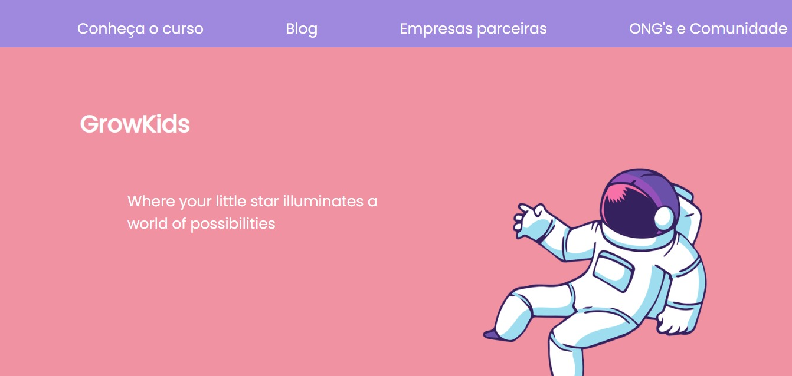

**Projeto de Estudo: Recriação de Design do Figma com HTML e CSS**

Durante meus estudos de desenvolvimento web, recriei um design do Figma usando HTML e CSS. Isso me permitiu praticar minhas habilidades de codificação.

Tela replicada: [Protótipo do Projeto Front-End](https://www.figma.com/community/file/1134174464609136612/prototipo-projeto-front-end)

---

### Layout Codificado

